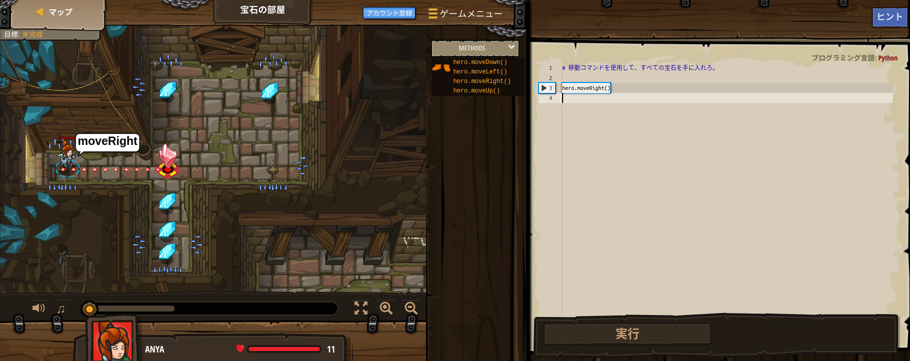
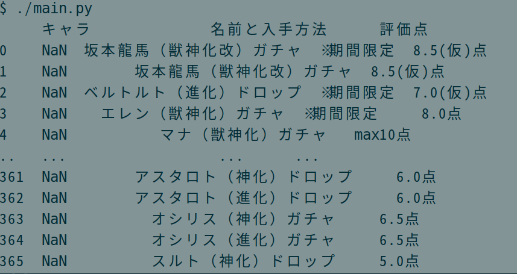

# Programming 講習




## 自己紹介

- 大舛(おおます) 直彦
- ITカレッジ沖縄 講師
- 昨年からモンストを始めた，進撃の巨人コラボ リヴァイ，ミカサ，エレン コンプリートで大満足
    - level 375
    - 運極  141

## 今日学ぶこと

- プログラミングを学ぶと面白いことができることを知る
- Hour of Codeを使って楽しくプログラミングの基礎を学ぶ
- Code.org の Computer Science Education Week(12月 7 - 13日)を知る

## 今日見せること

以下をLiveコーディングする

1. Ranking Data の一覧を Gamewith から取得するプログラム
2. クエストの最適キャラを該当ページから取得するプログラム

## 用語

|  keyword             |  説明                                                                                                 |
| ---------------------| ----------------------------------------------------------------------------------------------------- |
| Code.org             | 学生による計算機科学の勉強を支援することを目的とした非営利団体                                        |
| ウェブスクレイピング | ウェブサイトから情報を抽出するコンピュータソフトウェア技術のこと                                      |
| GameWith             | 国内最大級のゲーム情報メディア                                                                        |
| モンスターストライク | 株式会社ミクシィ内のスタジオ「XFLAG」から配信されているiOS・Android用ゲームアプリ。                   |

## Live coding


### [GameWith MonsterStrike Rating Page](https://xn--eckwa2aa3a9c8j8bve9d.gamewith.jp/article/show/284) からデータを取得

#### コード

```python
import pandas as pd

uri = 'https://xn--eckwa2aa3a9c8j8bve9d.gamewith.jp/article/show/284'
table = pd.read_html(uri, match='評価点')[0]

print(table)
```

#### 結果




#### 必要なデータの絞り込み


```python
import pandas as pd

uri = 'https://xn--eckwa2aa3a9c8j8bve9d.gamewith.jp/article/show/284'
table = pd.read_html(URI, match='評価点')[0]

table = table.drop(columns='キャラ')                              # 画像はいらない 
table = table[table['名前と入手方法'].str.contains('）ガチャ　')] # ガチャキャラだけ
table = table.sort_values('評価点', ascending=False)              # 点数が高い順に並び替え

print(table)
```

#### 整形したデータを ファイルに書き込み 

```python
import pandas as pd

uri = 'https://xn--eckwa2aa3a9c8j8bve9d.gamewith.jp/article/show/284'
table = pd.concat(pd.read_html(uri, match='評価点'))              # すべての属性を取得

table = table.drop(columns='キャラ')                              
table = table[table['名前と入手方法'].str.contains('）ガチャ　')]
table = table.sort_values('評価点', ascending=False)

today = pd.to_datetime('today').strftime('%Y%m%d')                # 今日の日付
table.to_csv(f'./gw.{today}.csv', index=False, encoding="utf-8")  # ファイルに書き込み


```